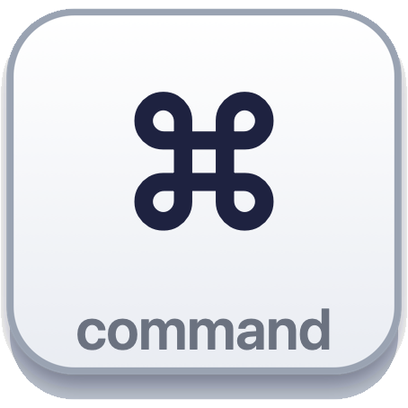
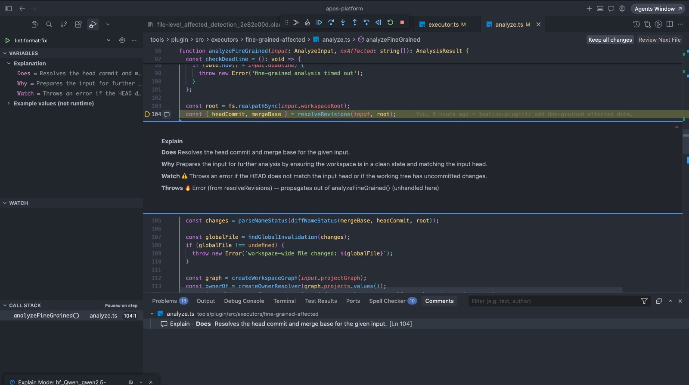
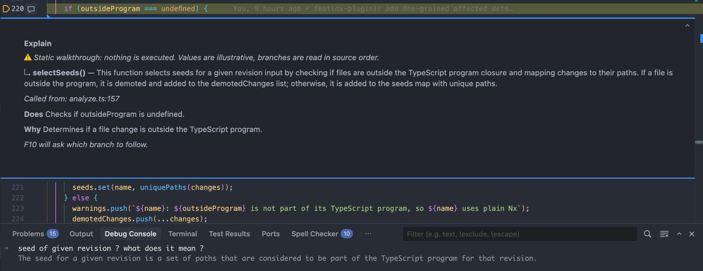
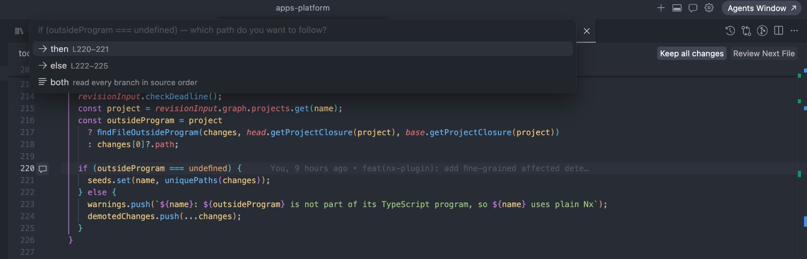
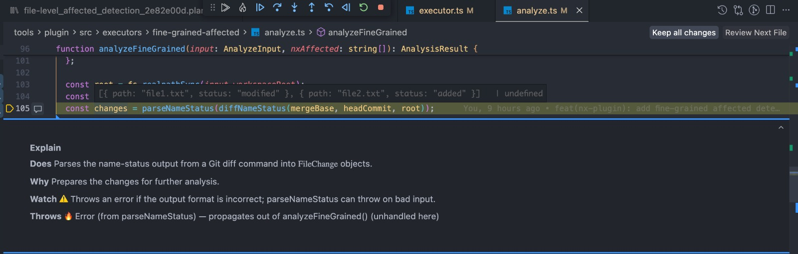
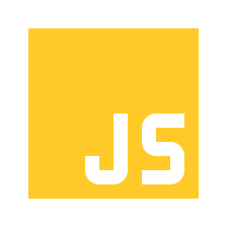
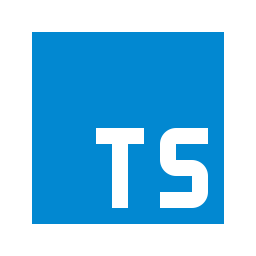
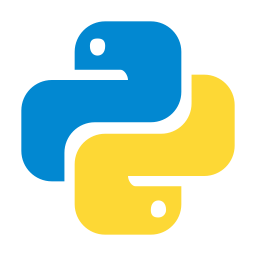

<p align="center">
  
</p>

<h1 align="center">DeBuddy</h1>

<p align="center">
  <b>The placebo debugger. Nothing runs. Everything gets explained.</b><br>
  <i>An AI that explains your code line by line, through a debugger interface.</i><br>
  F10 · F11 · breakpoints · call stack · branch choice · follow the exception — a local model explains each statement in place, on code you have never read.
</p>

<table align="center">
  <tr>
    <td align="center" width="25%"><h3>🎛️</h3></td>
    <td align="center" width="25%"><h3>🔌</h3></td>
    <td align="center" width="25%"><h3>🧩</h3></td>
    <td align="center" width="25%"><h3>🗣️</h3></td>
  </tr>
  <tr>
    <td align="center" valign="top"><b>A native debugger experience</b><br><sub>A real Debug Adapter: F10 / F11 / Shift+F11, breakpoints, call stack, variables, step back, auto-walk</sub></td>
    <td align="center" valign="top"><b>Zero configuration, 100% local</b><br><sub>One model download on first use, then no server, no key, no network — your code never leaves the machine</sub></td>
    <td align="center" valign="top"><b>VS Code · Cursor · VSCodium</b><br><sub>Any editor that runs VS Code extensions, with the same shortcuts</sub></td>
    <td align="center" valign="top"><b>JavaScript/TypeScript · Python · Rust, natively</b><br><sub>Exact walkers; Go, Java, C#, Swift, PHP, Ruby… through the language server</sub></td>
  </tr>
</table>

<p align="center">
  <a href="https://marketplace.visualstudio.com/items?itemName=MisterPandaPooh.debuddy"></a>
  <a href="https://open-vsx.org/extension/MisterPandaPooh/debuddy"></a>
  <a href="https://github.com/MisterPandaPooh/debuddy/releases"></a>
  <a href="https://github.com/MisterPandaPooh/debuddy/actions/workflows/ci.yml"></a>
  
</p>

<p align="center">
  
  <br>
  <sub>Put the cursor on any line and press <b>⌘ ⌥ E</b> (<kbd>Ctrl</kbd>+<kbd>Alt</kbd>+<kbd>E</kbd> on Windows/Linux). That is the whole setup.</sub>
</p>

<p align="center">
  
</p>

---

You open a function you did not write. Instead of reading it top to bottom and guessing, you
**start DeBuddy on a line and press <kbd>F10</kbd>**. The next statement lights up, and a short card
appears right under it:

> **Does** Fetches the user by id and attaches its roles.<br>
> **Why** The order needs the user's email for the audit below.<br>
> **Watch** ⚠️ Returns null when the id is unknown.<br>
> **Throws** 🔥 NotFoundError (from getUser) — caught by `catch (err)` L23

Press <kbd>F11</kbd> on a call and you are inside the callee, with a one-line summary, where it is
called from, and the reason you came. <kbd>⇧</kbd>+<kbd>F11</kbd> brings you back. Reach an `if … else` and <kbd>F10</kbd> asks
which branch to read. Reach a `throw` and <kbd>F10</kbd> takes you to the `catch` that receives it — or
tells you it leaves the function.

**It feels like a debugger because it *is* one** — a real VS Code Debug Adapter, with the native
toolbar, call stack, breakpoints and variables views, the shortcuts you already know, in
**VS Code, Cursor or VSCodium**.

**Nothing is executed and nothing is configured.** The extension works out of the box, **100 %
locally**: the model never guesses what a function does — the callees, the types, the throw sites
and even the **test names that describe the function** are resolved deterministically and handed
to a small model that runs on your machine. **JavaScript/TypeScript, Python and Rust are
supported natively** (exact syntax walkers); other languages ride on their language server.

## Install

**Nothing to configure.** The first explanation downloads a 2.1 GB model (Qwen2.5-Coder 3B)
into the extension's storage, once, after asking you. Then it is all local, ~0.5 s per line.

- **VS Code**: [DeBuddy on the Marketplace](https://marketplace.visualstudio.com/items?itemName=MisterPandaPooh.debuddy) — or search for *DeBuddy* in the Extensions view.
- **Cursor, VSCodium, Windsurf**: [DeBuddy on Open VSX](https://open-vsx.org/extension/MisterPandaPooh/debuddy) — or search for *DeBuddy* in the Extensions view.
- **VSIX**: grab the file for your platform from the [releases page](https://github.com/MisterPandaPooh/debuddy/releases),
  then `Extensions → ⋯ → Install from VSIX…`. Works in **VS Code** and **Cursor**.

Prefer your own stack? Pick it from the status bar: Ollama (any model), GitHub Copilot models,
an OpenAI-compatible API, the Claude Code CLI or the Cursor CLI — the last two run on the
subscription you already have. See [Model providers](#model-providers).

## 60-second tour

| Do this | You get |
|---|---|
| Put the cursor on a line, <kbd>⌘</kbd>+<kbd>⌥</kbd>+<kbd>E</kbd> (Win/Linux <kbd>Ctrl</kbd>+<kbd>Alt</kbd>+<kbd>E</kbd>) | the session starts there; the first card appears |
| <kbd>F10</kbd> | next statement, explained |
| <kbd>F11</kbd> on `getUser(id)` | inside `getUser`, with its summary and who calls it |
| <kbd>⇧</kbd>+<kbd>F11</kbd> | back to the call site, on the next statement |
| <kbd>F10</kbd> on an `if … else` | *then / else / both* — pick the path to read |
| <kbd>F10</kbd> / <kbd>F11</kbd> on a lone `if` or a loop | the condition's value is unknown: <kbd>F10</kbd> stays on the main path (skips the block), <kbd>F11</kbd> reads it; guards (`if (x) return …`) are flagged as such |
| <kbd>F10</kbd> on a `throw` | jumps to the `catch` that receives it, or says it leaves the function |
| 💥 (toolbar) on a call that *may* throw | follows that possibility instead of the happy path |
| <kbd>F9</kbd> then <kbd>F5</kbd> | runs silently to the breakpoint — across calls, like a debugger |
| ▶▶ (toolbar) or <kbd>⌘</kbd>+<kbd>⌥</kbd>+<kbd>A</kbd> | **auto-walk**: prepares the statements ahead (progress notification), then advances every few seconds; <kbd>F6</kbd> pauses |
| ◀ Step Back | previous stops, call stack included |
| hover a variable | an example value that matches its type (`user = { id: "u_42" } // or: null`) |
| type in the Debug Console | a question about the current line, answered with its context |

<p align="center">
  <br>
  <sub>Step Into: the callee's one-line summary, <i>Called from</i>, and a question typed in the Debug Console.</sub>
</p>

<p align="center">
  <br>
  <sub>F10 on an <code>if … else</code>: pick the path to read.</sub>
</p>

<p align="center">
  <br>
  <sub>Hover a variable: an example value that matches its type, next to the normal language hover.</sub>
</p>

## Languages

<p align="center">
  &nbsp;&nbsp;&nbsp;&nbsp;
  &nbsp;&nbsp;&nbsp;&nbsp;
  &nbsp;&nbsp;&nbsp;&nbsp;
  
  <br>
  <sub><b>Supported natively</b> — exact syntax walkers: statements, <code>if</code> branches, <code>try/catch/finally</code>, <code>raise</code>/<code>except</code>, <code>?</code>/<code>Err</code>/<code>panic!</code>, <code>match</code> arms as branches.</sub>
</p>

**Other languages** — Go, Java, Kotlin, Scala, C#, C, C++, Objective-C, Dart, Swift, PHP, Ruby… —
go through the **LSP-generic walker**: statements come from the language server's document
symbols and selection ranges, branches and `try` from keyword tables. Precision depends on the
language server you have installed.

Step Into works even without a language server: the walker finds the function in the file,
then in the workspace. With one (Pylance, rust-analyzer, gopls…) you also get types and callers.

## Model providers

`explain.provider` picks the model; everything (steps, summaries, values, console) goes through it.
Change it from the status bar (`DeBuddy: embedded · Qwen2.5-Coder 3B`). **Claude Code and Cursor
work with the subscription you already have** — no API key, nothing billed per token.

| Provider | Needs | Per-step | Notes |
|---|---|---|---|
| `embedded` (default) | nothing to install | ~0.7 s | one model, the measured sweet spot; +55 MB of extension (native binary per platform) |
| `ollama` | Ollama + any model (`explain.model`) | ~0.4 s | tiers measured in [bench/RESULTS.md](bench/RESULTS.md): `qwen2.5-coder:0.5b` (0.4 GB) → `3b` (default) → `7b` → `qwen2.5:14b` (9 GB); above 2 GB latency grows faster than accuracy |
| `openai` | base URL + `DeBuddy: Set API key` | 1–3 s | OpenRouter, OpenAI, LM Studio, vLLM, Ollama's `/v1`; the key lives in VS Code secret storage |
| `vscode-lm` | GitHub Copilot (or any Language Model Chat Provider extension) | 1–3 s | one consent prompt; not available in Cursor |
| `claude-cli` | Claude Code CLI, signed in with your **Claude subscription** (Pro/Max) | ~3 s amortized | one call per **function**, a pool of persistent sessions, `--effort low`, settings/hooks/MCP skipped; API-key env vars are hidden so it can only use your login |
| `cursor-cli` | Cursor Agent CLI, `agent login` once — your **Cursor subscription** | ~5–15 s | one call per function; pick the model from the status bar (effort is in its name; the Free plan only allows `auto`) |

On seconds-per-call providers the extension makes **one call per function**: the function, its
resolved callees, types, tests and throw sites go once, and every statement, the summary and the
example values are cached from that single answer. Local models keep one call per statement.

Whatever the provider, the statements ahead are prepared in the background while you read: the
Step Over path, the first lines of the functions it calls, two levels down (`explain.prefetch.*`).
Auto-walk prepares that window first, with a progress notification, then never waits on the model.

Your code leaves your machine only with `openai`, `vscode-lm`, `claude-cli` or `cursor-cli` — and
only to the service you chose.

## Settings worth knowing

| Setting | Default | What it does |
|---|---|---|
| `explain.provider` | `embedded` | the model backend |
| `explain.language` | `English` | language of the prose (labels stay) |
| `explain.askBranch` | `true` | F10 on an `if` asks which branch to follow |
| `explain.auto.dwellMs` | `3000` | milliseconds per line in auto-walk |
| `explain.prefetch.ahead` | `10` | statements prepared ahead along the Step Over path, in the background (every stop extends the window) |
| `explain.prefetch.into` | `5` | first statements of each callee in that window, so Step Into is instant |
| `explain.prefetch.depth` | `2` | levels of callees prepared (0 = only the Step Over path) |
| `explain.prefetch.parallel` | `2` | background model calls in flight; the statement on screen always has its own slot |
| `explain.context.definitionDepth` | `2` | go-to-definition levels fed to the model |
| `explain.exampleValues` | `true` | one extra local call per statement for example values |
| `explain.preload` | `false` | load the model as soon as a supported file is open (otherwise it loads when a session starts, overlapping with the first explanation) |

## Develop

```bash
npm install
npm run build          # esbuild bundle + grammars → dist/
npm run typecheck
npm run test:dap       # headless Debug Adapter harness (:auto, :throw, :batch variants)
npm run test:lang      # steps every language walker produces on the samples
npm run bench          # prompt bench against the local model
```

Open the repo in VS Code, **F5** → an Extension Development Host on `sample/`. See
[CONTRIBUTING.md](CONTRIBUTING.md) for how to add a language or a provider, and
[docs/PUBLISHING.md](docs/PUBLISHING.md) for the Marketplace / Open VSX release steps.

VS Code gotchas met here, all silent: `@vscode/debugadapter` dispatches `setBreakpoints` to
`setBreak**P**ointsRequest`; manifest contributions load only when a host **window starts**
(close it, launch a new one); the debug toolbar menu id is `debug/tool**B**ar`; `web-tree-sitter`
must stay outside the esbuild bundle (its `createRequire(import.meta.url)`).

## License

MIT — see [LICENSE](LICENSE).
